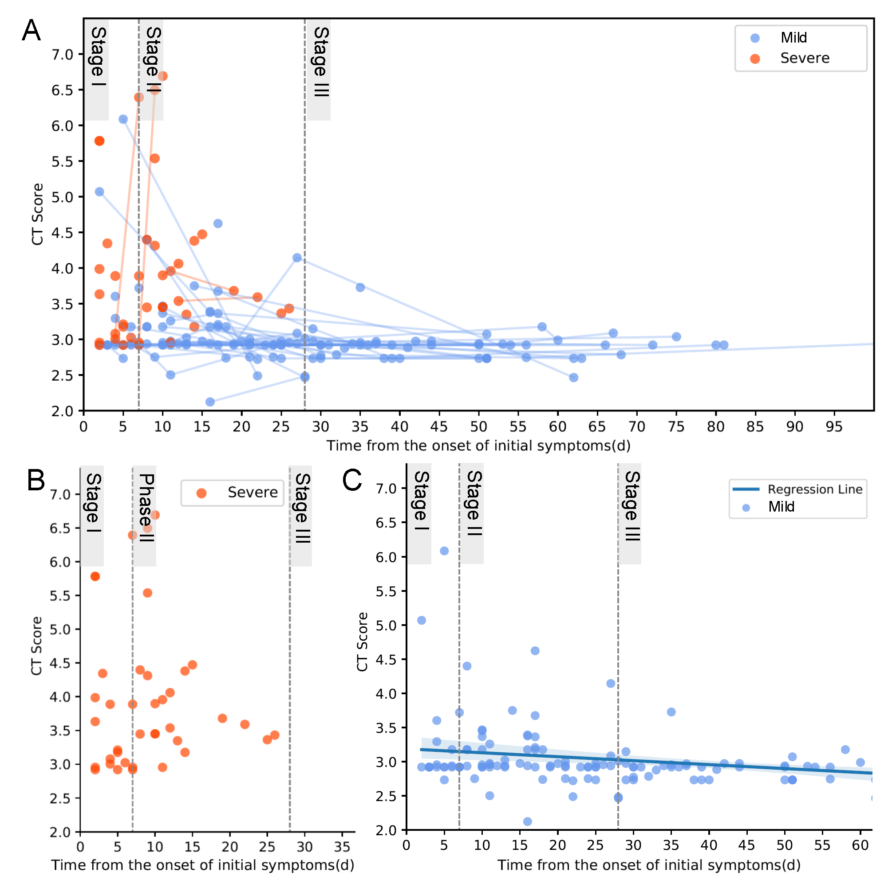
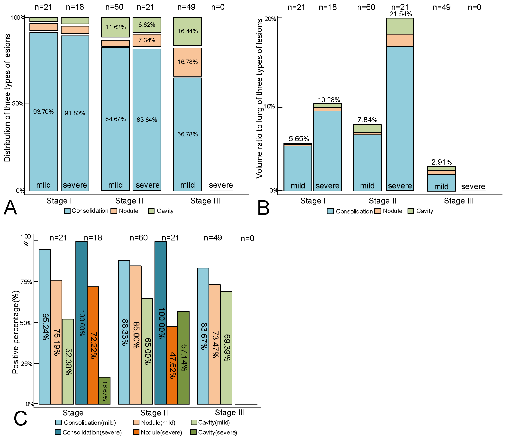
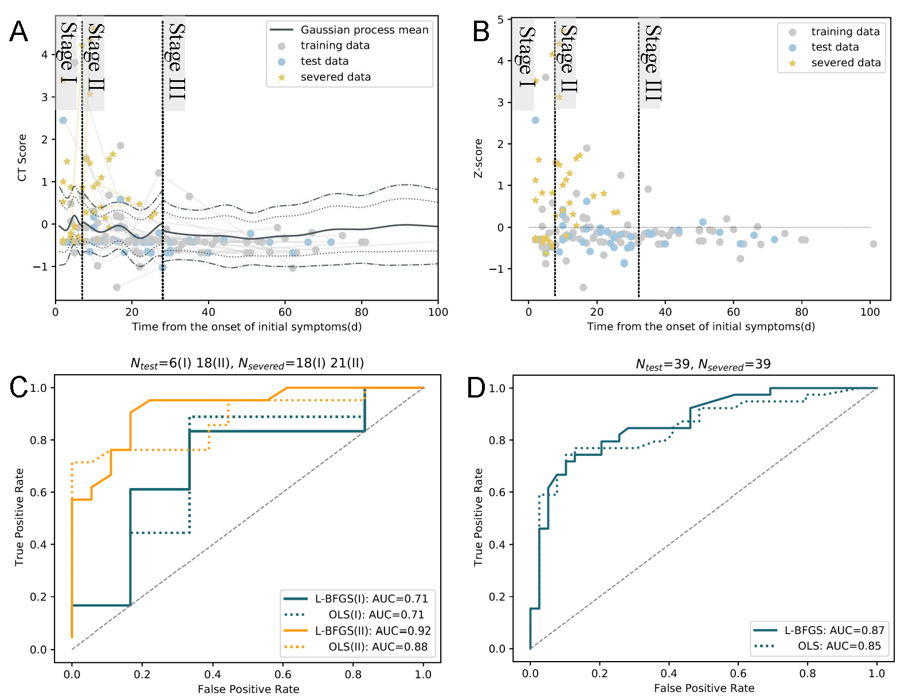

# A-new-CT-score-based-staging-for-melioidosis-pneumonia-to-predict-progression
This repository inlcudes official implementations for CT score of melioidosis pneumonia
## Abstract
**Background:** Chest CT is used to assess the severity of lung involvement in melioidosis pneumonia.

**Purpose:** To quantitatively extract CT features and evaluate CT score-based staging in predicting melioidosis pneumonia progression.

## Installation
The following command will clone a copy of CT score to your computer using git:
```
git clone https://github.com/Rsolut1on/MP_CTscore.git
```
## Results
CT scores of the patients with melioidosis pneumonia based on chest CT scans from the time of onset of the initial symptoms.
<div align=center>

</div>
Bar graph showing the changes in the distribution of the three lesions at different stages.
<div align=center>

</div>
The L-BFGS Gaussian process predicted severe outcome patients, and the receiver operating characteristic curve is shown using the CT-score to predict severe in the mild test set and severe set.
<div align=center>

</div>

## Getting Started
We use `scikit-mage==0.18.1` `nibable==3.2.1` `scikit-learn==1.0.2` `scipy==1.7.3` `numpy==1.21.6` libraries in this code.

- For CT feature_extraction, please see [feature_extraction.py](feature_extraction.py)
- For CT feature process, please see [feature_process.py](feature_process.py)
- For CT score genertion, please see [CTscore_genertor.m](CTscore_genertor.m)
- For progression predicting, please see [gpr_predection.py](gpr_predection.py)

Our sample data is available for download at [Baidu Cloud](https://pan.baidu.com/s/1EnTbmVQuWDSPd9D3iaIORw), code: jqiu.
## Citing
```
title={A new CT score-based staging for melioidosis pneumonia to predict progression},
author={Yang Chen1,2,15, Dehuai He1,15, Yehua Wu3, Jianqiang Chen4, Xiangying Li5, Xiaohua Li4, Long Fan6, Shengshi Mai7, Jingxiong Li8, Xiaohua Fu5,9, Zewei Wang10, Hao Yun11, Hanwen Chen12, Yuefu Zhan13*, Xiaobo Zhou14}
```
